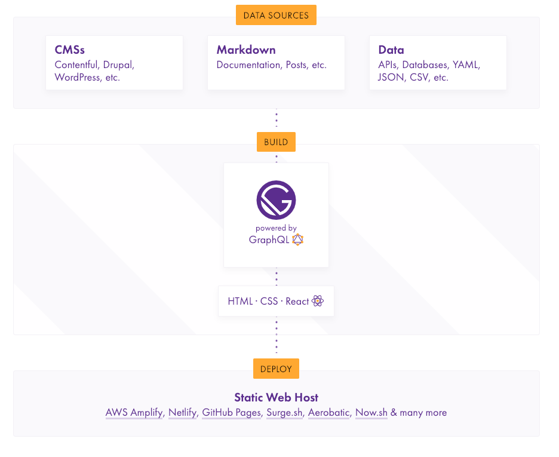

## 블로그 만들기(1)
이전에 몇번 git blog를 만들어 보려 hexo 를 사용했었다.

* 목차
  * Why Gatsby?
  * Setup Git page
  * Setup Jenkins for GitHub repository
  * Configure to build automatically when it is pushed to GitHub
  * Review

### Why Gatsby

Gatsby는 Static Site Generator 이다.
Jekyll & Hexo 또한 같은 정적 사이트 생성기이며 처음에는 Hexo를 이용해서 블로그를 만들었었다.
Jekyll 은 Ruby on Rails 기반이며, Hexo는 Node.js기반이여서 나는 고치기 쉬울것 같은 Hexo를 선택해서 사용하였다.
사용하던 중 프론트엔드 쪽 지식이 별로 없어 Hexo theme가 맘에 안들어도 꾸역꾸역 쓰고 있었는데..
그 와중에 맘에 드는 템플릿(https://gatsby-starter-bee.netlify.com/)을 만나 바꾸게 되었다.

### Setup Git page

우선 git page(https://pages.github.com/) 설정은 github에서 repo를 만들고 Repository name 을 [username].github.io로 설정해 주면 된다.

### Setup Jenkins for GitHub repository

OS : ubuntu:18.04
Docker : 18.09.7

Docker를 사용한 이유는 AWS를 EC2서버를 사용하다 바꾸는 경우가 가끔 있었고 다양한 환경의 서버들을 다루기 꺼려져 Docker를 사용하였습니다. Docker의 경우 설치하고 한번 사용한 이미지 그대로 가져와서 사용하면 되서 환경에 영향을 받지 않죠.
삽질을 줄일 수 있다는 점이나 안정성에서 만족하며 사용하고 있습니다.

```sh
# Docker CE (Community Edition) install
sudo apt update
sudo apt install apt-transport-https ca-certificates curl software-properties-common
```

```sh
curl -fsSL https://download.docker.com/linux/ubuntu/gpg | sudo apt-key add -

OK
```

```sh
sudo add-apt-repository "deb [arch=amd64] https://download.docker.com/linux/ubuntu  $(lsb_release -cs)  stable" 

sudo apt-get update
```

```sh
sudo apt-get install docker-ce   # Docker CE (Community Edition)
```

확인을 위해

```sh
docker --version
```
