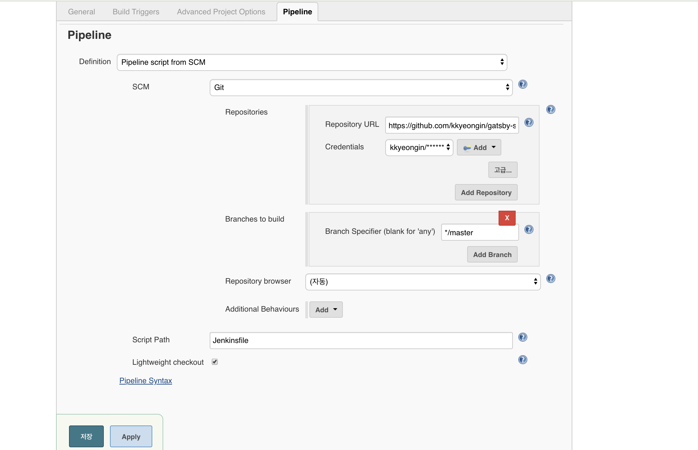
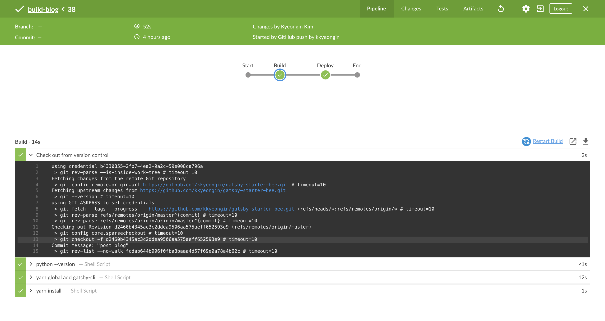
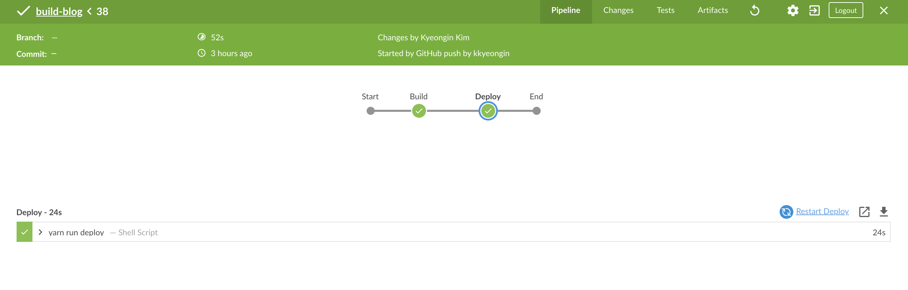

## 블로그 만들기(2)

* Goal
  * Setup Jenkins for GitHub repository
  * Configure to build automatically when it is pushed to GitHub
  * Make Jenkinsfile
  * Review

### 1. Setup Jenkins for GitHub repository


1. jenkins의 기본적인 것을 세팅한 후, jenkins plugin에서 jenkins blue ocean plugin을 전부 설치한다.

2. jenkins > 새로운 item을 만들어 Pipe line을 선택한다.

3. SCM을 git으로 설정 후 github계정을 연결시켜 둔다.




4. SCM을 git으로 설정 후 github계정을 연결시켜 둔다.

### 2. Make Jenkinsfile

이제 젠킨스 파일만 만들면 된다.

```sh
pipeline {
    agent {
        docker {
            image 'ubuntu:dockerfile'
            args '-p 3000:3000'
        }
    }
    environment {
        CI = 'true' 
    }
    stages {
        stage('Build') {
            steps {
                sh 'python --version'
                sh 'yarn global add gatsby-cli'
                sh 'yarn install'
            }
        }
        stage('Deploy') { 
            steps {
                sh 'yarn run deploy' 
            }
        }
    }
}
```

docker image `ubuntu:dockerfile` 은 이전편에서 만들었던 docker image 이다.
없다면 docker hub에서 찾아올 것 이다.

### Review





설정 후 blue ocesen을 통해 빌드가 처리되는 것을 볼 수 있다.

아직 부족한 점이 많아서 삽질을 많이 했고 블로그가 보강할게 많은 것 같다.

### 참고

* [make git ssh key](https://jootc.com/p/201905122827)
* [jenkins build-a-node-js-and-react-app-with-npm](https://jenkins.io/doc/tutorials/build-a-node-js-and-react-app-with-npm/#on-macos-and-linux)
