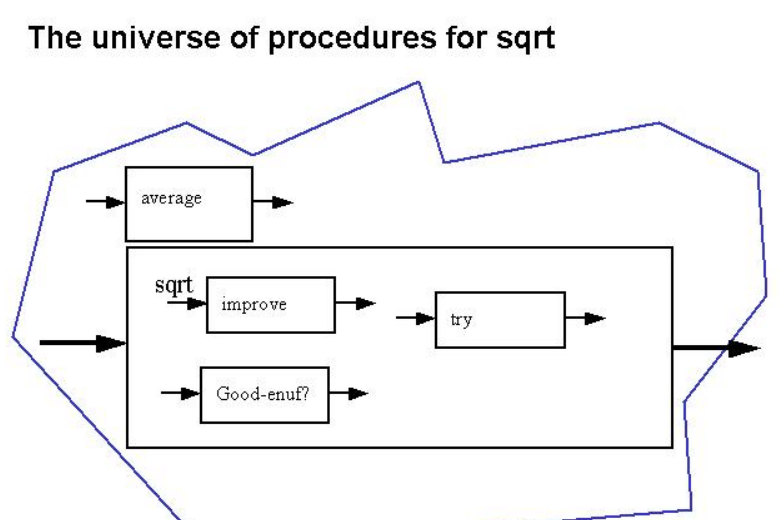
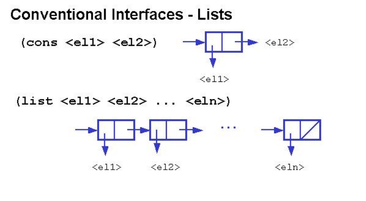
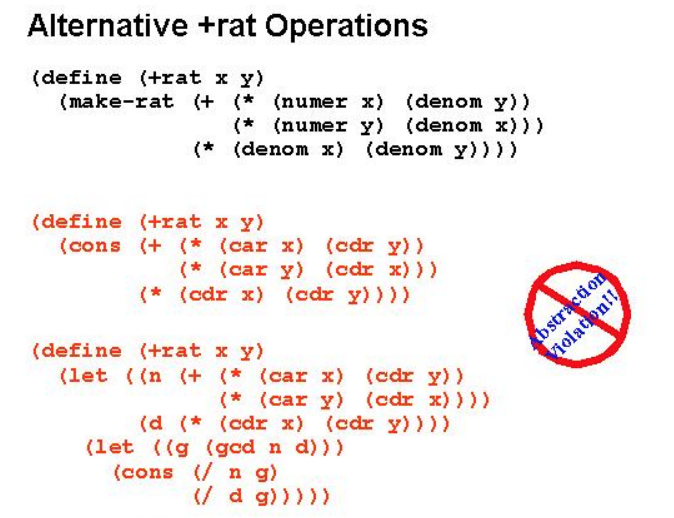

# Data Abstraction

> 데이터의 구조를 숨기고 interface를 통해 사용
> data를 combination하는 법을 알아보자.

들어가기 전에 procedural abstraction을 먼저 알아보자.

## procedural abstraction

1. common pattern을 찾고
2. 람다를 사용해서 procedure를 나타내고
3. 이름을 붙인다.

### e.i

```fs
let goodEnough guess x =
    abs (guess * guess - x) < 0.00001

let average x y =
    (x+y) / 2.0

let improve guess x =
    average guess (x / guess)

let rec loop guess x =
    if goodEnough guess x
    then guess
    else loop (improve guess x) x
    ; with full thinking

let sqrt x = loop 1.0 x
```

다시 사용될 코드는 밖에로 빼고
dependency가 강한 것들은 같은 함수로 넣어주는 것이 좋다. 
--> block structure



```fs

let average x y =
    (x+y) / 2.0

; block structure
let sqrt x =
    let goodEnough guess x =
        abs (guess * guess - x) < 0.00001
    let improve guess x =
        average guess (x / guess)
    let rec loop guess x =
        if goodEnough guess x
        then guess
        else loop (improve guess x) x
    loop 1.0 x
```

이제 다시 돌아와서 Data Abstraction을 어떻게 이루어지 알아보자.  

## compound data

> 묶어서 만들어야(constructor) 하며, 해체(selector or accessor) 또한 가능해야 한다.
> predicate; pair인지 아닌지 (boolean)

### pair

```fs
type Pair<'a,'b> = Pair of 'a * 'b

let cons x y = Pair (x,y)
let car (Pair (x,y)) = x
let cdr (Pair (x,y)) = y

let makePoint x y = cons x y
let pointX p = car p
let pointY p = cdr p
let makeLine p1 p2 = cons p1 p2
let start_point line = car line

(*
lengthOfLine = sqrt ((x1-x2)^2 + (y1 - y2)^2)
*)
```

## list



> pair로 list를 만들 수도 있다. 구조체를 보자면 linked list다.

```fs
(*
fromTo 1 4
...
==> 1 :: (2 :: (3 :: (4 :: [])))
...
==> [1;2;3;4]
*)

let rec fromTo start finish =
    if start > finish then []
    else start :: fromTo (start+1) finish
```

```fs
let rec length ls =
    if ls = [] then 0
    else 1 + length (List.tail ls)
```

결론적으로 data abstructure는 data 구조가 어떻게 구현되었는지는 감춘다. constructor와 selector를 interface 통해 사용하면 된다.



detail을 숨기고 interface를 사용하도록 한다면 나중의 확장성 및 변경에 영향이 없도록 함이다.

* 관련 문서
  
  * [SICP_L5_Data Abstraction](https://ocw.mit.edu/courses/electrical-engineering-and-computer-science/6-001-structure-and-interpretation-of-computer-programs-spring-2005/lecture-notes/lecture5webhand.pdf)